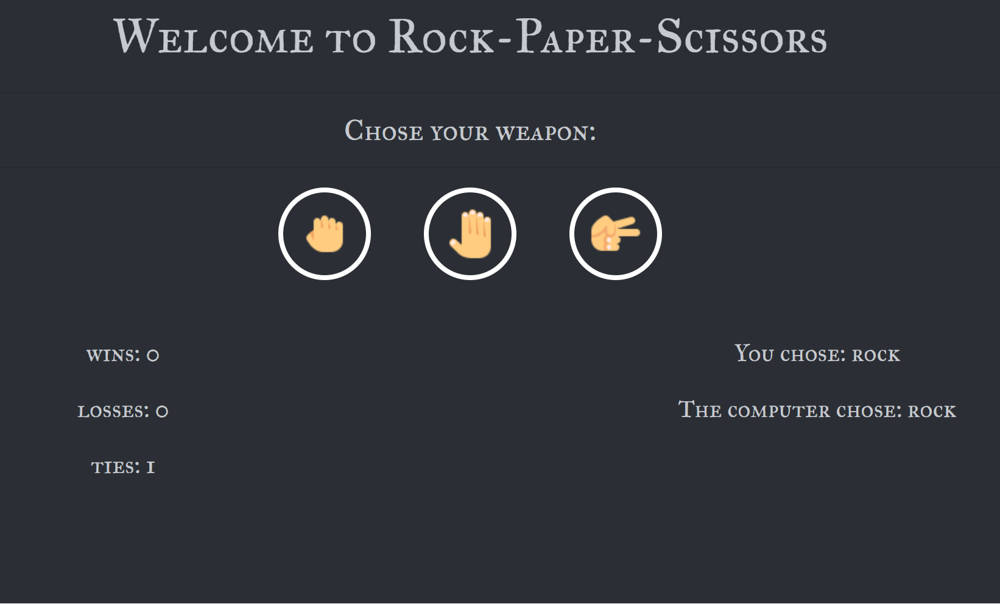

This is a web based game, using the same logic as a rock, paper and scissors game. 

## Game Logic

The user selects one of the three options from the icons displayed. Depending on the user selection and a random choice made by the oponent the user will get a point added to wins, losses, or ties. 

The usual game rules apply: 
    Rock beats Scissors.
    Paper beats Rock.
    Scissors beats Paper. 
    Both select the same option will result in a tie.

## JavaScript

When coding this game we first declare variables for the score (win, lose, tie), and then create variables that will retain the user choice based on event listeners and the oponent choice based on a random math function. 

The main function is what determines if the user wins, loses or ties depending on the conditions of the if/else statements.

After the choices are made and the functions retun the values the reuslts are then converted from letter to words and displayed in the DOM for the user to see.

### Special thanks to:

Icons:
https://www.flaticon.com/free-icons/ & https://icons8.com/icons/ 

Font:
https://fonts.google.com/

Front-End Library:
https://getbootstrap.com/

### Important Links:

GitHub Repository: https://github.com/CookieChef/Rock_Paper_Scissors.git

Game Link: https://cookiechef.github.io/Rock_Paper_Scissors/

